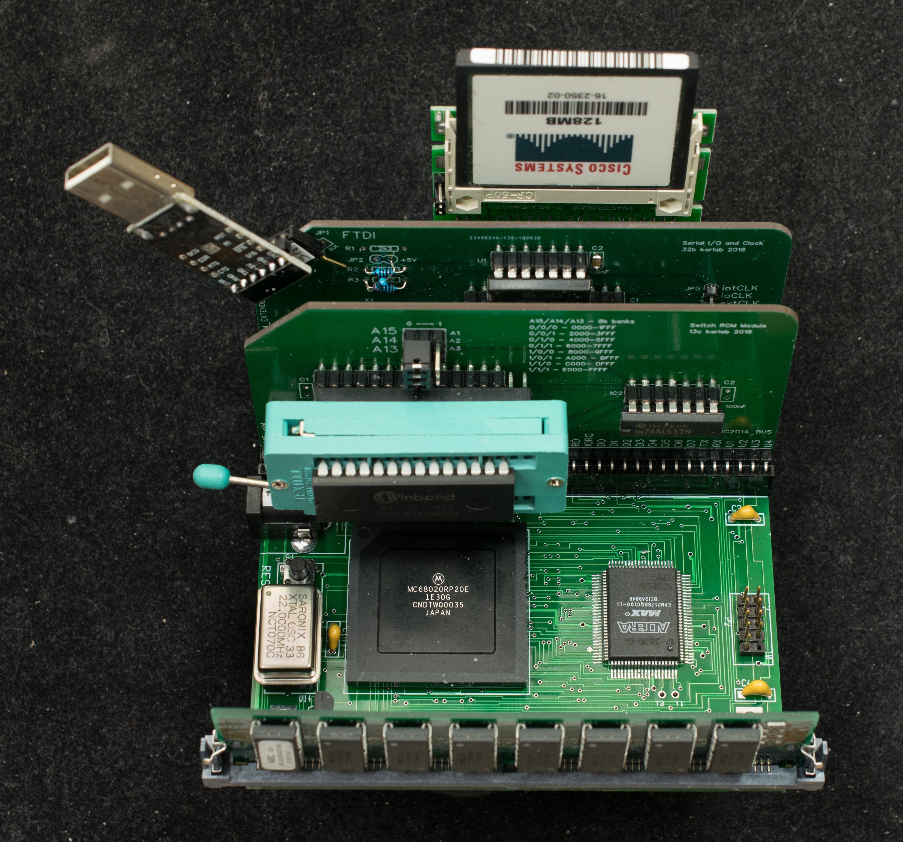

# MB020
MB020 is a 4“x4” 68020-based motherboard with 3 RC2014 expansion slots. It allows RC2014 users to reuse their existing hardware to explore the 68020 processor.

### Features
- MC68020
- 4/16 meg 72-pin SIMM DRAM
- 66.67Hz (14.7456MHz clock) level 1 autovector interrupt
- Three RC2014 expansion slots

### Functions
MB020 consists of a 4“x4” motherboard populated with 68020, EPM7128S, SIMM72 socket and 3 RC2014 expansion slots. The purpose is to reuse the existing RC2014 boards to explore MC68020. To that end, the boot ROM, I/O, mass storage will be the existing RC2014 boards. A 68020 monitor will be developed for the boot ROM so it can load files, display & modify memory and registers, and run applications. The I/O can be RC2014 SIO2 or 68B50 boards and a RC2014 CF board can be added to run CP/M68K.

### Design Info
- [Schematic](mb020_rev1_scm.pdf)
- [Gerber photoplots](), 4-layer pc board
- Bill of Materials
- Engineering change. An enginnering change is required to connect CPLD's reset to 68020 reset.
- [CPLD](mb020_r0_cpld_design_files.zip) design files

### Memory map

### Software Tools
- IDE68K ver 3.3

### Example Configurations
- Karlab's 8K ROM, ACIA, and CF.
- FRR512K modified as a combination board of ROM/ACIA/CF for MB020

builderpages/plasmo/mb020.txt · Last modified: 2023/02/11 1
